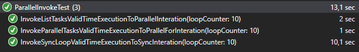

# ParallelTasks
Example of parallel tasks execution with .Net Core 3.1 - ParallelFor x ListTaskFor x SyncFor

  

## Result:

- Rank
1) List of parallel tasks: 1 second  
2) Loop ParallelFor tasks: 2 second  
3) Loop synchronous tasks: 10 second

- Parameters Used:
  - loopCounter = 10 tasks
  - waitingTime = 1000 ms  
  10 tasks with waiting time of 1 second  

  